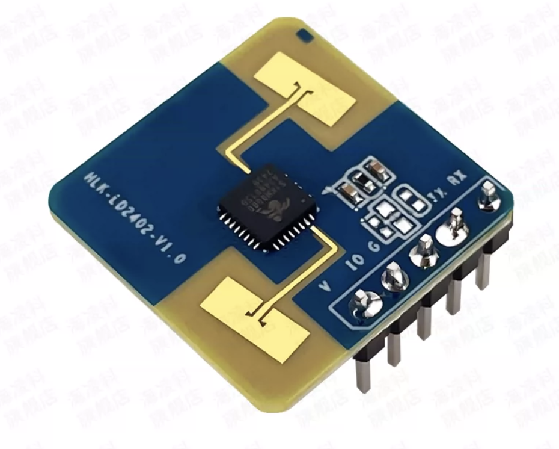

# LD2402 Arduino library

Portable, non-blocking Arduino support for the HLK-LD2402 mmWave
presence/distance sensor. The library parses the sensor's normal-mode ASCII
UART output from any Arduino `Stream` and includes a small helper for the
active-high OT/IO presence pin.



There is no CI badge in this repository because no CI workflow is configured.
The reproducible Arduino CLI build commands are documented in
[docs/EXAMPLES.md](docs/EXAMPLES.md).

## Features

- Non-blocking byte-by-byte parser for `distance:<cm>` and `OFF` records.
- Constructor accepts `Stream&`; no serial port is hardcoded in the library.
- Optional eight-sample moving-average distance filter, enabled by default.
- Freshness check with `isDataValid()` and `lastUpdateMs()`.
- UART-free `LD2402PresencePin` helper with optional debounce.
- Fixed-size buffers, no `String`, no dynamic allocation, and no delays in the
  library.
- Portable source intended for RP2040, ESP32, classic AVR UNO, UNO R4, and UNO Q.

## Limitations

- The library is listen-only. It does not configure the sensor or send commands.
- It parses normal-mode ASCII only. The engineering-mode binary energy frame is
  intentionally left to the raw reader in `extras/`.
- `SoftwareSerial` at the sensor's fixed 115200 baud may lose data on a classic
  UNO. Prefer a hardware UART or an external UART adapter.
- Compilation does not prove correct power, voltage levels, wiring, upload, or
  physical sensor behavior.

## Compatible boards

The source uses portable Arduino APIs. These targets have been used for the
example build checks in this checkout:

| Board | FQBN used for verification | UART example |
| --- | --- | --- |
| Raspberry Pi Pico W | `rp2040:rp2040:rpipicow` | `examples/RP2040/UART_Reader` |
| ESP32 Dev Module | `esp32:esp32:esp32` | `examples/ESP32/UART_Reader` |
| ESP32-S3 generic target | `esp32:esp32:esp32s3` | `examples/ESP32S3/UART_Reader` |
| Arduino UNO, classic AVR | `arduino:avr:uno` | `examples/Common/DistancePresence` |
| Arduino UNO R4 WiFi | `arduino:renesas_uno:unor4wifi` | `examples/Common/DistancePresence` |
| Arduino UNO Q | `arduino:zephyr:unoq` | `examples/Common/DistancePresence` |

Other boards may work when they provide an Arduino `Stream` and the usual GPIO
APIs, but they are outside this repository's verified matrix.

## Wiring

Cross the UART directions: sensor `T/TX` goes to board RX, and sensor `R/RX`
goes to board TX. Connect sensor ground to board ground.

| Controller | LD2402 T/TX -> board RX | LD2402 R/RX <- board TX | OT/IO input |
| --- | --- | --- | --- |
| Pico W | GP1 (`Serial1` RX) | GP0 (`Serial1` TX) | GP2 |
| ESP32 Dev Module | GPIO16 (UART2 RX) | GPIO17 (UART2 TX) | GPIO2 |
| ESP32-S3 example | GPIO16 (UART1 RX) | GPIO17 (UART1 TX) | GPIO2 |
| classic UNO | D10 (`SoftwareSerial` RX) | D11 (`SoftwareSerial` TX) | D2 |
| UNO R4 WiFi | D0 (`Serial1` RX) | D1 (`Serial1` TX) | D2 |
| UNO Q | board-defined `Serial1` RX | board-defined `Serial1` TX | 3.3 V-safe input |

The LD2402 UART and OT/IO signals are 3.3 V interfaces. Do not drive the
sensor RX directly from a 5 V UNO TX pin. Use an appropriate level shifter or
divider and verify the sensor TX level is safe for the controller input. The
manual identifies J2 pin 2 as OT/IO and J2 pin 3 as ground; power the sensor as
specified by the supplied V1.09 manual.

The ESP32-S3 pin choice is only a default. Change the constants in its example
for the actual board. The UNO Q pin mapping is board-package dependent and
must be checked against the board documentation.

## Install

For Arduino IDE, install this repository as the `LD2402` library folder in the
Arduino libraries directory, or use the IDE's library ZIP installation. Then
restart the IDE and open one of the sketches under `examples/`.

For Arduino CLI, keep the checkout in a directory passed with `--libraries`, as
shown in [docs/EXAMPLES.md](docs/EXAMPLES.md).

## Quick start: UART parser

Configure the selected UART for `115200 8N1`, cross TX/RX, and pass the stream
to the constructor. The parser consumes only bytes already available.

```cpp
#include <Arduino.h>
#include <LD2402.h>

LD2402 sensor(Serial1);

void setup() {
  Serial.begin(115200);
  Serial1.begin(115200);
}

void loop() {
  sensor.update();

  if (sensor.isDataValid()) {
    Serial.print("raw=");
    Serial.print(sensor.getDistanceRawCm());
    Serial.print(" filtered=");
    Serial.print(sensor.getDistanceFilteredCm());
    Serial.print(" present=");
    Serial.println(sensor.isPresent() ? 1 : 0);
  }
}
```

On a Pico W, set the UART pins before `begin()` when they are not the core
defaults:

```cpp
Serial1.setTX(0);
Serial1.setRX(1);
Serial1.begin(115200);
```

See the board-specific UART readers for complete setup branches.

## Quick start: OT/IO pin

Use this when distance data is not needed. The default example pin is `2`,
which is GP2 on a Pico W.

```cpp
#include <Arduino.h>
#include <LD2402.h>

LD2402PresencePin presence(2, 30);

void setup() {
  Serial.begin(115200);
  presence.begin();
}

void loop() {
  if (presence.update()) {
    Serial.println(presence.isPresent() ? "present" : "clear");
  }
}
```

## API summary

### `LD2402`

| API | Description |
| --- | --- |
| `LD2402(Stream& stream)` | Wrap an existing serial stream. |
| `bool update()` | Consume available bytes; returns true if a valid record was accepted. |
| `bool read()` | Alias for `update()`. |
| `void setFilterEnabled(bool)` | Enable or disable the eight-sample filter. |
| `bool isFilterEnabled()` | Return the filter setting. |
| `uint16_t getDistanceRawCm()` | Most recent raw distance in centimetres. |
| `uint16_t getDistanceFilteredCm()` | Filtered distance, or raw distance when disabled. |
| `bool isPresent()` | Last parsed presence state. |
| `bool isDataValid(uint32_t maxAgeMs = 1000)` | True after a valid record and until it becomes stale. |
| `uint32_t lastUpdateMs()` | `millis()` time of the last valid record. |

### `LD2402PresencePin`

| API | Description |
| --- | --- |
| `LD2402PresencePin(uint8_t pin, uint32_t debounceMs = 30)` | Configure an active-high OT/IO input. |
| `begin()` | Set the pin as an input and establish the initial state. |
| `update()` | Sample the pin; true only after a debounced state change. |
| `isPresent()` | Current debounced state. |
| `rawPresence()` | Most recent digital sample. |
| `pin()` | Configured input pin number. |

## Protocol

The supplied manual V1.09 describes normal-mode output as ASCII records such
as `distance:158\r\n` and `OFF\r\n` at `115200 8N1`. The library accepts those
records and does not parse the separate engineering-mode binary frame.

See the full [LD2402 protocol reference](docs/LD2402_PROTOCOL.md) for the
record grammar, binary-frame outline, OT/IO behavior, logic-level warning, and
the exact scope of the parser.

## Examples

| Example | Use |
| --- | --- |
| [`RP2040/UART_Reader`](examples/RP2040/UART_Reader/UART_Reader.ino) | Pico W UART reader and Serial Plotter output. |
| [`ESP32/UART_Reader`](examples/ESP32/UART_Reader/UART_Reader.ino) | ESP32 UART2 reader. |
| [`ESP32S3/UART_Reader`](examples/ESP32S3/UART_Reader/UART_Reader.ino) | ESP32-S3 UART1 reader with configurable pins. |
| [`Common/DistancePresence`](examples/Common/DistancePresence/DistancePresence.ino) | Raw, filtered, presence, and freshness API demonstration. |
| [`Common/GPIOPresence`](examples/Common/GPIOPresence/GPIOPresence.ino) | UART-free OT/IO presence input. |
| [`extras/legacy-sketches/LD2402_RawReader`](extras/legacy-sketches/LD2402_RawReader/LD2402_RawReader.ino) | Raw hexadecimal troubleshooting reader. |

The UART readers print the Serial Plotter-friendly line:

```text
distance_cm_raw:158 distance_cm_filtered:158 presence:1
```

The complete workflow and compile matrix are in
[docs/EXAMPLES.md](docs/EXAMPLES.md).

## Manual and vendor files

The supplied HLK-LD2402 tool bundle was used as development reference material,
but its third-party DLLs, firmware, logs, saved radar data, and manual are not
included in the public library release. The public tree retains only the
user-authored raw reader under `extras/legacy-sketches/`. See
[docs/RELEASE_AUDIT.md](docs/RELEASE_AUDIT.md) for the inclusion and licensing
decision.

## License

This library is released under the MIT License. See [LICENSE](LICENSE).
